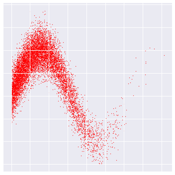
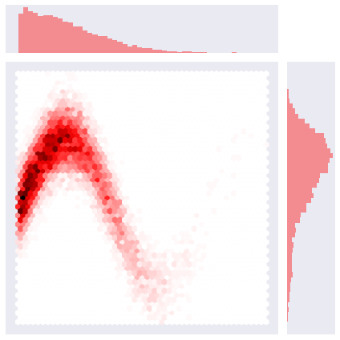
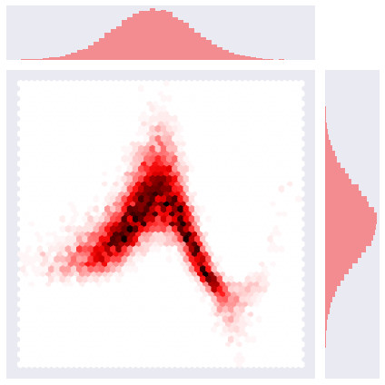
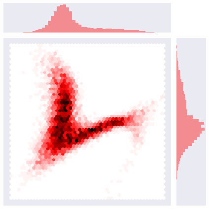
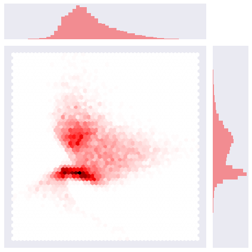
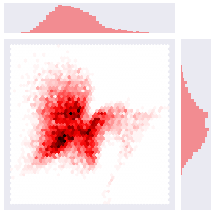
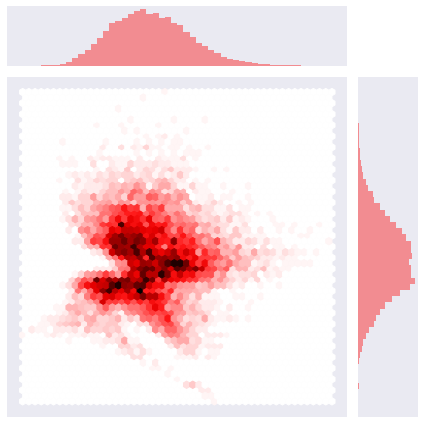
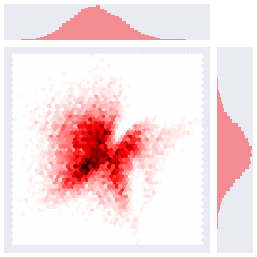
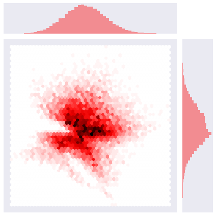
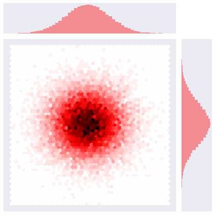

```python
import sys
sys.path.append('/home/emmanuel/code/rbig')
sys.path.append('/home/emmanuel/code/destructive-deep-learning')

figsave_path = '/home/emmanuel/projects/2019_rbig_info/reports/figures/invertible_flows/'

import numpy as np
import seaborn as sns

from rbig.rbig import RBIGKLD, RBIG, RBIGMI, entropy_marginal
from ddl.datasets import make_toy_data
import matplotlib.pyplot as plt
from scipy import stats
plt.style.use('seaborn')
sns.set_style({
    'axes.axisbelow': False,
    'xtick.bottom': False,
    'axes.spines.left': False,
    'axes.spines.bottom': False,
})
%matplotlib inline
%load_ext autoreload
%autoreload 2
```

## Data


```python
seed = 123
rng = np.random.RandomState(seed=seed)

dataset = 'rbig_sin_wave'
n_samples = 10000

dat = make_toy_data(dataset, n_samples, seed)

X, y = dat.X, dat.y
```


```python
fig, ax = plt.subplots(figsize=(5, 5))
ax.scatter(X[:, 0], X[:, 1], s=1, c='red')
plt.tick_params(
    axis='both',          # changes apply to the x-axis
    which='both',      # both major and minor ticks are affected
    bottom=False,      # ticks along the bottom edge are off
    left=False,
    top=False,         # ticks along the top edge are off
    labelbottom=False,
    labelleft=False) # labels along the bottom edge are off
plt.tight_layout()
xlims, ylims = plt.xlim(), plt.ylim()
plt.show()
# fig.savefig(f"{figsave_path}/original.png")
# print(ax.xlim)
```


    

    


```python
# sns.set_style("dark")
# sns.despine()
fig  = plt.figure(figsize=(5, 5))

g = sns.jointplot(x=X[:, 0], y=X[:, 1], kind='hex', color='red')
g.ax_joint.set_xticks([])
g.ax_joint.set_yticks([])
# # sns.despine()
# sns.set_style("ticks", 
#               {
#                   'bottom': False,
#                   'axis': 'both',
#                   'which': 'both',
#                   'labelbottom': False,
#                   'labelleft': False,
#                   'left': False,
#                   'top': False,
#                   'xticks': []
# })
# plt.axis('off')
# plt.show()
plt.tight_layout()
g.savefig(f"{figsave_path}/rbig_0_data.png", transparent=True)
```


    <Figure size 360x360 with 0 Axes>


    

    


### RBIG Algorithm - 1 Layer (for Demonstration)


```python
n_layers = 1
rotation_type = 'PCA'
random_state = 123
zero_tolerance = 100
base = 'gauss'

# Initialize RBIG class
rbig_model = RBIG(n_layers=n_layers, rotation_type=rotation_type, 
                  random_state=random_state, zero_tolerance=zero_tolerance, base=base)

# fit model to the data
rbig_model.fit(X);
```

#### Step I - Marginal Gaussianization


```python
fig = plt.figure(figsize=(5, 5))

mg_data = rbig_model.gauss_data @ rbig_model.rotation_matrix[0].T

g = sns.jointplot(x=mg_data[:, 0], y=mg_data[:, 1], kind='hex', color='red')
g.ax_joint.set_xticks([])
g.ax_joint.set_yticks([])
plt.tight_layout()
g.savefig(f"{figsave_path}/rbig_1_mg.png", transparent=True)
```


    <Figure size 360x360 with 0 Axes>


    

    


#### Step II - Rotation


```python
fig = plt.figure(figsize=(5, 5))

g = sns.jointplot(
    x=rbig_model.gauss_data[:, 0], 
    y=rbig_model.gauss_data[:, 1],
    kind='hex', color='red'
)
g.ax_joint.set_xticks([])
g.ax_joint.set_yticks([])
plt.tight_layout()
g.savefig(f"{figsave_path}/rbig_2_rotation.png", transparent=True)
```


    <Figure size 360x360 with 0 Axes>


    

    


## RBIG Algorithms - 2,3,4,5 Layers


```python
n_layers = [1, 2, 3, 4, 5, 6]
rotation_type = 'PCA'
random_state = 123
zero_tolerance = 100
base = 'gauss'

for ilayer in n_layers:
    # Initialize RBIG class
    rbig_model = RBIG(n_layers=ilayer, rotation_type=rotation_type, 
                      random_state=random_state, zero_tolerance=zero_tolerance, base=base)

    # fit model to the data
    rbig_model.fit(X);
    
    # transform data
    data_trans = rbig_model.transform(X)
    
    # Plot Layer
    plot_gauss_layer(data_trans, ilayer)
```


    <Figure size 360x360 with 0 Axes>


    

    


    <Figure size 360x360 with 0 Axes>


    

    


    <Figure size 360x360 with 0 Axes>


    

    


    <Figure size 360x360 with 0 Axes>


    

    


    <Figure size 360x360 with 0 Axes>


    

    


    <Figure size 360x360 with 0 Axes>


    

    


```python
def plot_gauss_layer(data, layer):
    fig = plt.figure(figsize=(5, 5))

    g = sns.jointplot(
        x=data[:, 0], 
        y=data[:, 1],
        kind='hex',
        color='red'
    )
    g.ax_joint.set_xticks([])
    g.ax_joint.set_yticks([])
    plt.tight_layout()
    g.savefig(f"{figsave_path}/rbig_l{layer}_gaussian.png", transparent=True)
```

### Full RBIG Algorithm


```python
n_layers = 1000
rotation_type = 'PCA'
random_state = 123
zero_tolerance = 100
base = 'gauss'

# Initialize RBIG class
rbig_model = RBIG(n_layers=n_layers, rotation_type=rotation_type, 
                  random_state=random_state, zero_tolerance=zero_tolerance, base=base)

# fit model to the data
rbig_model.fit(X);
```


```python
# transform data
data_trans = rbig_model.transform(X)

fig = plt.figure(figsize=(5, 5))

g = sns.jointplot(
    x=data_trans[:, 0], 
    y=data_trans[:, 1],
    kind='hex',
    color='red'
)
g.ax_joint.set_xticks([])
g.ax_joint.set_yticks([])
plt.tight_layout()
g.savefig(f"{figsave_path}/rbig_l_gaussian.png", transparent=True)
```


    <Figure size 360x360 with 0 Axes>


    

    


```python
rbig_model.n_layers
```


    64


```python

```
