# RBIG Demo


```python
import sys
sys.path.insert(0, '/home/emmanuel/code/py_packages/rbig/')
sys.path.insert(0, '/home/emmanuel/code/rbig/')
sys.path.insert(0, '/Users/eman/Documents/code_projects/rbig/')

import numpy as np
import warnings
from time import time
from rbig.rbig import RBIG, entropy
# from rbig.model import RBIG
from sklearn.model_selection import train_test_split
from sklearn.utils import check_random_state
import matplotlib.pyplot as plt
plt.style.use('ggplot')
warnings.filterwarnings('ignore') # get rid of annoying warnings

%matplotlib inline
%load_ext autoreload
%autoreload 2
```

    The autoreload extension is already loaded. To reload it, use:
      %reload_ext autoreload


#### Toy Data


```python
seed = 123
rng = np.random.RandomState(seed=seed)

num_samples = 10_000
x = np.abs(2 * rng.randn(1, num_samples))
y = np.sin(x) + 0.25 * rng.randn(1, num_samples)
data = np.vstack((x, y)).T

fig, ax = plt.subplots()
ax.scatter(data[:, 0], data[:, 1], s=1)
ax.set_xlabel('X')
ax.set_ylabel('Y')
ax.set_title('Original Data')
plt.show()
```


    
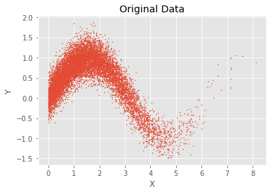
    


## RBIG Fitting


```python
%%time 

n_layers = 1000
rotation_type = 'pca'
random_state = 123
zero_tolerance = 10

# Initialize RBIG class
rbig_model = RBIG(n_layers=n_layers, rotation_type=rotation_type, 
                  random_state=random_state, zero_tolerance=zero_tolerance)

# transform data
data_trans = rbig_model.fit_transform(data)
```

    CPU times: user 932 ms, sys: 43.2 ms, total: 975 ms
    Wall time: 335 ms


### Transform Data into Gaussian


```python

```


```python

print(data_trans.shape)
fig, ax = plt.subplots()
ax.scatter(data_trans[:, 0], data_trans[:, 1], s=1)
ax.set_xlabel('X')
ax.set_ylabel('Y')
ax.set_title('Data after RBIG Transformation')
plt.show()
```

    (10000, 2)


    
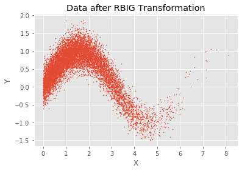
    


### Invertible


```python
%%time
# transform data
data_approx = rbig_model.inverse_transform(data_trans)

# check approximation
np.testing.assert_array_almost_equal(data, data_approx)
```

    CPU times: user 1.86 ms, sys: 9 µs, total: 1.87 ms
    Wall time: 1.62 ms


#### Check Residuals


```python
data_approx = rbig_model.inverse_transform(data_trans)
residual = np.abs(data - data_approx).sum().sum()

print(f'Residual from Original and Transformed: {residual:.2e}')
```

    Residual from Original and Transformed: 0.00e+00


```python
fig, ax = plt.subplots()
ax.scatter(data_approx[:, 0], data_trans[:, 1], s=1)
ax.set_xlabel('X')
ax.set_ylabel('Y')
ax.set_title('Inverse Transformation')
plt.show()
```


    
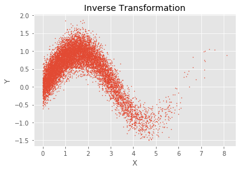
    


### Information Reduction


```python
residual_info = rbig_model.residual_info

fig, ax = plt.subplots()
ax.plot(np.cumsum(rbig_model.residual_info))
ax.set_title('Information Reduction')
plt.show()
```


    
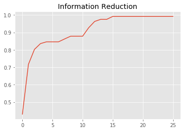
    


### Generated Synthetic Data


```python
data_synthetic = rng.randn(data.shape[0], data.shape[1])

fig, ax = plt.subplots()
ax.scatter(data_synthetic[:, 0], data_synthetic[:, 1], s=1)
ax.set_xlabel('X')
ax.set_ylabel('Y')
ax.set_title('Synthetically generated factorial gaussian data')
plt.show()
```


    
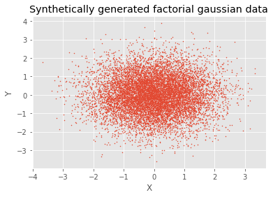
    


### Synthesize New Data from RBIG Model


```python
data_original_synthetic = rbig_model.inverse_transform(data_synthetic)

fig, ax = plt.subplots()
ax.scatter(data_original_synthetic[:, 0], data_original_synthetic[:, 1], s=1)
# ax.scatter(data[:, 0], data[:, 1], s=1)

ax.set_ylim([-1.5, 2.0])
ax.set_xlim([0.0, 9.0])
ax.set_xlabel('X')
ax.set_ylabel('Y')
ax.set_title('Synthetically generated data from the input distribution')
plt.show()
```


    
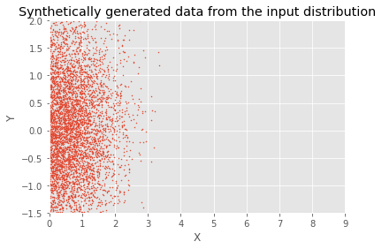
    


### Jacobian


```python
%%time

jacobian = rbig_model.jacobian(data, return_X_transform=False)

print(jacobian.shape)

print(f"Jacobian - min: {jacobian.min():.3e}, max: {jacobian.max():.3e}")
```

    (10000, 2, 2)
    Jacobian - min: 0.000e+00, max: 1.000e+00
    CPU times: user 922 µs, sys: 1.02 ms, total: 1.94 ms
    Wall time: 1.58 ms


### Estimating Probabilities with RBIG


```python
%%time
prob_input, prob_gauss = rbig_model.predict_proba(data, domain='both', n_trials=1)
print(f"Prob Input Domain - min: {prob_input.min():.3e}, max: {prob_input.max():.3e}")
print(f"Prob Gauss Domain - min: {prob_gauss.min():.3e}, max: {prob_gauss.max():.3e}")
print(f"Det:: {rbig_model.det_jacobians:.3e}")
```

    Prob Input Domain - min: 2.713e-16, max: 1.588e-01
    Prob Gauss Domain - min: 2.713e-16, max: 1.588e-01
    Det:: 1.000e+00
    CPU times: user 6.96 ms, sys: 929 µs, total: 7.89 ms
    Wall time: 6.88 ms


### Original Data with Probabilities


```python
fig, ax = plt.subplots()
ax.hist(prob_input, 50, facecolor='green', alpha=0.75)
plt.show()
```


    
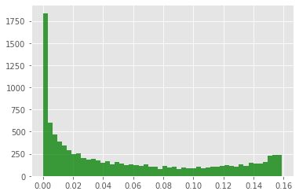
    


```python
fig, ax = plt.subplots()

h = ax.scatter(data[:, 0], data[:, 1], s=1, c=prob_input, cmap='Reds')

ax.set_xlabel('X')
ax.set_ylabel('Y')
cbar = plt.colorbar(h, )
ax.set_title('Original Data w/ Probabilities')
plt.show()
```


    
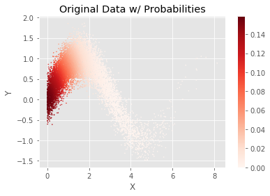
    


### Probability in Gaussian Domain


```python
# Plot the probability of the data in the Gaussian Domain
fig, ax = plt.subplots()

n, bins, patches = ax.hist(prob_gauss, 50, facecolor='green', alpha=0.75)
ax.set_title('Probability in Gaussian domain.')
plt.show()
```


    
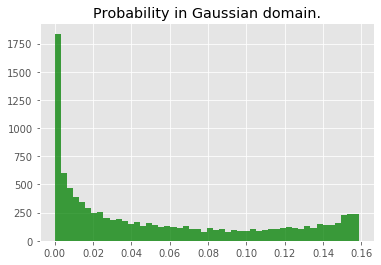
    


```python
# Plot the Probabilities of the data using colors
fig, ax = plt.subplots()
g = ax.scatter(data_trans[:, 0], data_trans[:, 1],
               s=1, c=prob_gauss)
ax.set_xlabel('X')
ax.set_ylabel('Y')
ax.set_title('Data after RBIG transform w/ Probabilities')
plt.colorbar(g)
plt.show()
```


    
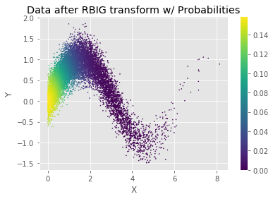
    


## Benchmarks


```python
data = np.random.randn(100_000, 100)
```


```python
%%time 

n_layers = 1000
rotation_type = 'pca'
random_state = 123
zero_tolerance = 10

# Initialize RBIG class
rbig_model = RBIG(
    n_layers=n_layers, 
    rotation_type=rotation_type, 
    random_state=random_state, 
    zero_tolerance=zero_tolerance,
    pdf_resolution=50,
)

# transform data
data_trans = rbig_model.fit_transform(data)
```

    CPU times: user 1min 59s, sys: 28.2 s, total: 2min 28s
    Wall time: 31.6 s


```python
rbig_model.n_layers
```


    0


```python
from rbig.model import RBIG as RBIG11
```


```python
%%time 
n_layers = 1000
rotation_type = 'pca'
random_state = 123
zero_tolerance = 60
verbose=0
method = 'custom'

# Initialize RBIG class
rbig_model = RBIG11(
    n_layers=n_layers, 
    rotation_type=rotation_type, 
    random_state=random_state, 
    zero_tolerance=zero_tolerance,
    verbose=verbose,
    method=method,
    pdf_resolution=50,
)

# transform data
data_trans = rbig_model.fit_transform(data)
```

    CPU times: user 8min 13s, sys: 1min 25s, total: 9min 38s
    Wall time: 1min 58s


```python
residual_info = rbig_model.residual_info
plt.
```


```python
%%time

data_inverted = rbig_model.inverse_transform(data_trans)
```

    CPU times: user 4min 10s, sys: 29.9 s, total: 4min 40s
    Wall time: 32.4 s


```python
%%time
prob_input, prob_gauss = rbig_model.predict_proba(data, domain='both', n_trials=1)
```


    ---------------------------------------------------------------------------

    KeyboardInterrupt                         Traceback (most recent call last)

    <timed exec> in <module>


    ~/code/rbig/rbig/rbig.py in predict_proba(self, X, n_trials, chunksize, domain)
        540             #     data_aux[start_idx:end_idx, :], return_X_transform=True
        541             # )
    --> 542             jacobians, data_temp = self.jacobian(data_aux, return_X_transform=True)
        543             # set all nans to zero
        544             jacobians[np.isnan(jacobians)] = 0.0


    ~/code/rbig/rbig/rbig.py in jacobian(self, X, return_X_transform)
        471                 for ilayer in range(self.n_layers):
        472 
    --> 473                     XX = np.dot(
        474                         gaussian_pdf[:, :, ilayer] * XX, self.rotation_matrix[ilayer]
        475                     )


    <__array_function__ internals> in dot(*args, **kwargs)


    KeyboardInterrupt: 


```python
plt.plot(np.cumsum(rbig_model.residual_info))
```


    [<matplotlib.lines.Line2D at 0x7f6119463d00>]


    
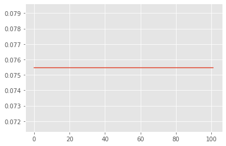
    


```python

```
