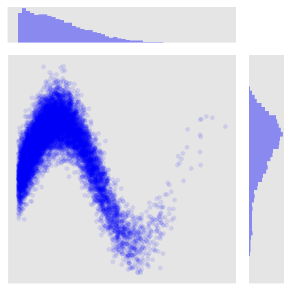
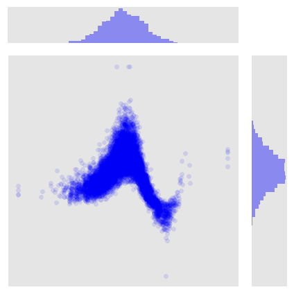
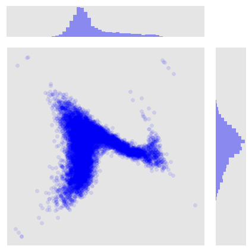

# RBIG Walk-Through (Naive)

This is a quick tutorial to show how the RBIG algorithm itself can be implemented very simply using standard scikit-learn tools. It consists of the following two steps 1) marginal Gaussianization and 2) rotation.


```python
import numpy as np
import warnings
from sklearn.preprocessing import QuantileTransformer
from sklearn.decomposition import PCA
from scipy.stats import rv_histogram, norm
import pandas as pd
import seaborn as sns

import sys
sys.path.insert(0, '/Users/eman/Documents/code_projects/rbig/')
from rbig import RBIG

import matplotlib.pyplot as plt
plt.style.use('ggplot')
warnings.filterwarnings('ignore') # get rid of annoying warnings

%matplotlib inline
%load_ext autoreload
%autoreload 2
```


```python
# Helper Plot Function
def plot_2d_joint(data, savename=None):
    fig  = plt.figure(figsize=(12, 5))

    g = sns.jointplot(x=data[:, 0], y=data[:, 1], kind='scatter', color='blue', alpha=0.1)
    g.ax_joint.set_xticks([])
    g.ax_joint.set_yticks([])
    plt.tight_layout()
    if savename:
        g.savefig(f"{savename}/rbig_0_data.png", transparent=True)
    plt.show()
    return None
```

## Data


```python
seed = 123
rng = np.random.RandomState(seed=seed)

num_samples = 10000
x = np.abs(2 * rng.randn(1, num_samples))
y = np.sin(x) + 0.25 * rng.randn(1, num_samples)
data = np.vstack((x, y)).T

d_dimensions = data.shape[1]

plot_2d_joint(data)
```


    <Figure size 864x360 with 0 Axes>


    

    


## Step I - Marginal Gaussianization

In this tutorial, for simplicity, I will use the quantile transformer found in the sklearn library. This transformer does an estimate of the CDF for each feature independently. Then the values are mapped to the Guassian distribution from the learned CDF function.


```python
n_quantiles = 1000
output_distribution = 'normal'
random_state = 123
subsample = 2000

# Quantile Transformer
mg_transformer = QuantileTransformer(
    n_quantiles=n_quantiles, 
    output_distribution=output_distribution, subsample=subsample
)

data_mg = mg_transformer.fit_transform(data)
```


```python
plot_2d_joint(data_mg)
```


    <Figure size 864x360 with 0 Axes>


    

    


### Step II - Rotation (PCA)


```python
pca_model = PCA()

data_rot = pca_model.fit_transform(data_mg)
```


```python
plot_2d_joint(data_rot)
```


    <Figure size 864x360 with 0 Axes>


    

    

