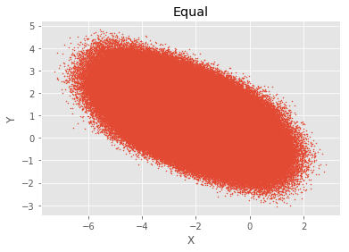
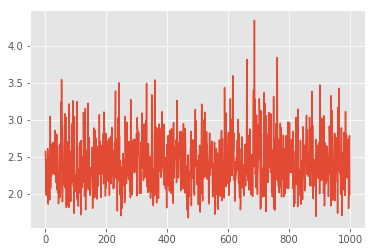
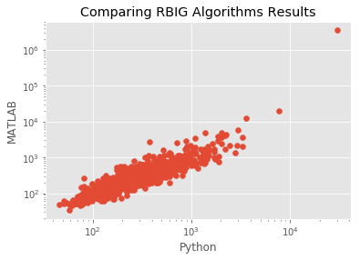
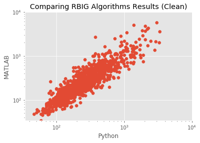
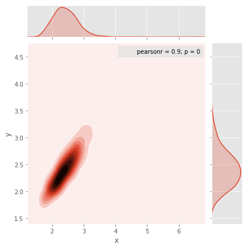
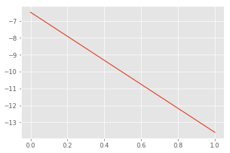
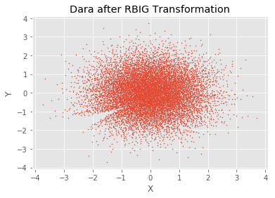
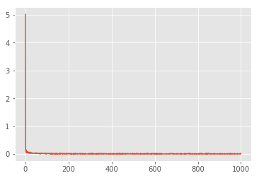

# RBIG Demo


```python
%matplotlib inline
import sys

sys.path.insert(0, '/home/emmanuel/code/py_packages/rbig/src')
sys.path.insert(0, '/home/emmanuel/code/rbig/')
# sys.path.insert(0, '/home/emmanuel/Drives/megatron/temp/2017_RBIG/')
# sys.path.insert(0, '/Users/eman/Documents/code_projects/rbig/')
import numpy as np
# import seaborn as sns
import pandas as pd
import warnings
from time import time
from rbig.rbig import RBIG
from sklearn.model_selection import train_test_split
from sklearn.utils import check_random_state
from scipy import io

import matplotlib.pyplot as plt
plt.style.use('ggplot')
warnings.filterwarnings('ignore') # get rid of annoying warnings

%load_ext autoreload
%autoreload 2
```

#### Toy Data


```python
seed = 123
rng = np.random.RandomState(seed=seed)
aux2 = io.loadmat('/media/disk/erc/papers/2018_RBIG_IT_measures/2018_RBIG_IT_measures/2018_RBIG/DATA/DATA_uniform_dim_10_seed_2.mat')


```


```python
seed = 123
rng = np.random.RandomState(seed=seed)
aux2 = io.loadmat('/media/disk/erc/papers/2018_RBIG_IT_measures/2018_RBIG_IT_measures/2018_RBIG/DATA/DATA_uniform_dim_10_seed_2.mat')

# aux2 = io.loadmat('/home/emmanuel/Drives/megatron/temp/2017_RBIG/DATA_uniform_dim_10_seed_2.mat')
data = aux2['dat'].T
data_original = aux2['aux'].T
R = aux2['R'].T
# num_samples = 10000
# x = np.abs(2 * rng.randn(1, num_samples))
# y = np.sin(x) + 0.25 * rng.randn(1, num_samples)
# data = np.vstack((x, y)).T

fig, ax = plt.subplots()
ax.scatter(data[:, 0], data[:, 1], s=1)
ax.set_xlabel('X')
ax.set_ylabel('Y')
ax.set_title('Equal')
plt.show()
```


    

    


```python
data_aux = np.dot(data_original, R)
```

## RBIG Fitting


```python
%%time

n_layers = 5
rotation_type = 'PCA'
random_state = 123
pdf_extension = 0.1
pdf_resolution = 1000

# Initialize RBIG class
rbig_model = RBIG(n_layers=n_layers, rotation_type=rotation_type, random_state=random_state, 
                  pdf_extension=0.1, pdf_resolution=100)

# fit model to the data
rbig_model.fit(data);
```

    CPU times: user 2min 38s, sys: 1.85 s, total: 2min 40s
    Wall time: 17.2 s


```python
ndet = 1000

jacobian = rbig_model.jacobian(data[:ndet, :])
print(jacobian.shape)
dd = np.zeros(ndet)

for i in range(ndet):
    aux = jacobian[i, ...].squeeze()
    dd[i] = np.abs(np.linalg.det(aux))
    
fig, ax = plt.subplots()
ax.plot(np.log10(dd))
plt.show()

fig_loc = '/home/emmanuel/projects/2019_rbig_info/reports/figures/rbig/'
save_name = 'test_rbig_py.png'
fig.savefig(fig_loc + save_name)
```

    (1000, 10, 10)


    

    


### Checking Versus MATLAB Results


```python
# load data
matlab_results = io.loadmat('/Users/eman/Documents/MATLAB/rbig_2018/test_results_matlab.mat')['dd'].squeeze()
py_results = dd
```


    ---------------------------------------------------------------------------

    FileNotFoundError                         Traceback (most recent call last)

    ~/.conda/envs/rbig_info/lib/python3.7/site-packages/scipy/io/matlab/mio.py in _open_file(file_like, appendmat)
         30     try:
    ---> 31         return open(file_like, 'rb'), True
         32     except IOError:


    FileNotFoundError: [Errno 2] No such file or directory: '/media/disk/erc/papers/2018_RBIG_IT_measures/2018_RBIG_IT_measures/2018_RBIG/DATA/test_results_matlab.mat'

    
    During handling of the above exception, another exception occurred:


    FileNotFoundError                         Traceback (most recent call last)

    <ipython-input-11-53a75f37242e> in <module>
          1 # load data
    ----> 2 matlab_results = io.loadmat('/media/disk/erc/papers/2018_RBIG_IT_measures/2018_RBIG_IT_measures/2018_RBIG/DATA/test_results_matlab.mat')['dd'].squeeze()
          3 py_results = dd


    ~/.conda/envs/rbig_info/lib/python3.7/site-packages/scipy/io/matlab/mio.py in loadmat(file_name, mdict, appendmat, **kwargs)
        205     """
        206     variable_names = kwargs.pop('variable_names', None)
    --> 207     MR, file_opened = mat_reader_factory(file_name, appendmat, **kwargs)
        208     matfile_dict = MR.get_variables(variable_names)
        209     if mdict is not None:


    ~/.conda/envs/rbig_info/lib/python3.7/site-packages/scipy/io/matlab/mio.py in mat_reader_factory(file_name, appendmat, **kwargs)
         60 
         61     """
    ---> 62     byte_stream, file_opened = _open_file(file_name, appendmat)
         63     mjv, mnv = get_matfile_version(byte_stream)
         64     if mjv == 0:


    ~/.conda/envs/rbig_info/lib/python3.7/site-packages/scipy/io/matlab/mio.py in _open_file(file_like, appendmat)
         35             if appendmat and not file_like.endswith('.mat'):
         36                 file_like += '.mat'
    ---> 37             return open(file_like, 'rb'), True
         38         else:
         39             raise IOError('Reader needs file name or open file-like object')


    FileNotFoundError: [Errno 2] No such file or directory: '/media/disk/erc/papers/2018_RBIG_IT_measures/2018_RBIG_IT_measures/2018_RBIG/DATA/test_results_matlab.mat'


```python


x_min = np.minimum(matlab_results.min(), py_results.min())
x_max = np.maximum(matlab_results.max(), py_results.max())

print(py_results.shape, matlab_results.shape)

fig, ax = plt.subplots()

ax.scatter(py_results, matlab_results)

ax.set_yscale('log')
ax.set_xscale('log')
ax.set_title('Comparing RBIG Algorithms Results')
ax.set_xlabel('Python')
ax.set_ylabel('MATLAB')

plt.show()

fig_loc = '/Users/eman/Desktop/'
save_name = 'test_mat_v_py.png'
fig.savefig(fig_loc + save_name)


fig, ax = plt.subplots()

ax.scatter(py_results, matlab_results)

ax.set_yscale('log')
ax.set_xscale('log')
ax.set_xlim([x_min, 10**4])
ax.set_ylim([x_min, 10**4])
ax.set_title('Comparing RBIG Algorithms Results (Clean)')
ax.set_xlabel('Python')
ax.set_ylabel('MATLAB')

plt.show()

fig_loc = '/Users/eman/Desktop/'
save_name = 'test_mat_v_py_clean.png'
fig.savefig(fig_loc + save_name)
```

    (1000,) (1000,)


    

    


    

    


```python
data = pd.DataFrame({
    'x': matlab_results, 
    'y': py_results})
```


```python
sns_plot = sns.jointplot(x="x", y="y", data=np.log10(data), kind="kde")
fig_loc = '/Users/eman/Desktop/'
save_name = 'test_mat_v_py_jointplot.png'
sns_plot.savefig(fig_loc + save_name)
# ax = g.ax_joint
# ax.set_xscale('log')
# ax.set_yscale('log')
```


    

    


```python
jacobian, data_transform2 = rbig_model.jacobian(data[:1000, :])

ndet = 1000
# dd = np.zeros(jacobian.shape[1])
for i in range(jacobian.shape[1]):
    dd[i] = np.linalg.det(jacobian[i, :, :])
    
# fig, ax = plt.subplots()
# ax.plot(dd)
# plt.show()
```


    

    


### Transform Data into Gaussian


```python
# transform data
data_trans = rbig_model.transform(data)

fig, ax = plt.subplots()
ax.scatter(data_trans[:, 0], data_trans[:, 1], s=1)
ax.set_xlabel('X')
ax.set_ylabel('Y')
ax.set_title('Dara after RBIG Transformation')
plt.show()
```


    

    


## BUCLE


```python
%%time 

n_layers = 1000
rotation_type = 'PCA'
random_state = 123
pdf_extension = 0.1
pdf_resolution = 1000
n_samples = 10000

R = np.array([[10, 0.5, 1, 7], [50, -3, 5, -5], [2, -3, 5, 4], [-2, -3, 5, 4]])
MIS = np.zeros(100)

for i in range(100):
    aux = np.random.rand(n_samples, 4)
    dat = np.dot(aux, R)
    rbig_model = RBIG(n_layers=n_layers, rotation_type=rotation_type, pdf_extension=pdf_extension,
                      pdf_resolution=pdf_resolution)
    g_data = rbig_model.fit(dat).transform(dat)
    
    di = rbig_model.residual_info
    
    MIS[i] = sum(di)
    print(i)

# # Initialize RBIG class
# rbig_model = RBIG(n_layers=n_layers, rotation_type=rotation_type, random_state=random_state, 
#                   pdf_extension=0.1, pdf_resolution=100)

# # fit model to the data
# rbig_model.fit(data);
```

    0
    1
    2
    3
    4
    5
    6
    7
    8
    9
    10
    11
    12
    13
    14
    15
    16
    17
    18
    19
    20
    21
    22
    23
    24
    25
    26


    ---------------------------------------------------------------------------

    KeyboardInterrupt                         Traceback (most recent call last)

    <timed exec> in <module>()


    ~/code/py_packages/rbig/src/rbig.py in transform(self, data)
        177                 # marginal gaussianization
        178                 data_layer[idim, :] = norm.ppf(
    --> 179                     data_layer[idim, :]
        180                 )
        181 


    ~/anaconda3/envs/sci_py36/lib/python3.6/site-packages/scipy/stats/_distn_infrastructure.py in ppf(self, q, *args, **kwds)
       1904         cond1 = (0 < q) & (q < 1)
       1905         cond2 = cond0 & (q == 0)
    -> 1906         cond3 = cond0 & (q == 1)
       1907         cond = cond0 & cond1
       1908         output = valarray(shape(cond), value=self.badvalue)


    KeyboardInterrupt: 


```python
fig, ax = plt.subplots()

ax.plot(di)
ax.show()
```


    ---------------------------------------------------------------------------

    AttributeError                            Traceback (most recent call last)

    <ipython-input-24-3df48be58a99> in <module>()
          2 
          3 ax.plot(di)
    ----> 4 ax.show()
    

    AttributeError: 'AxesSubplot' object has no attribute 'show'


    

    


```python
fig, ax = plt.subplots()

ax.plot(di)
ax.show(MIS)
```


    ---------------------------------------------------------------------------

    AttributeError                            Traceback (most recent call last)

    <ipython-input-25-1a669b5b5aa5> in <module>()
          2 
          3 ax.plot(di)
    ----> 4 ax.show(MIS)
    

    AttributeError: 'AxesSubplot' object has no attribute 'show'


    

    


```python
print(MIS.mean(), MIS.std())
```
